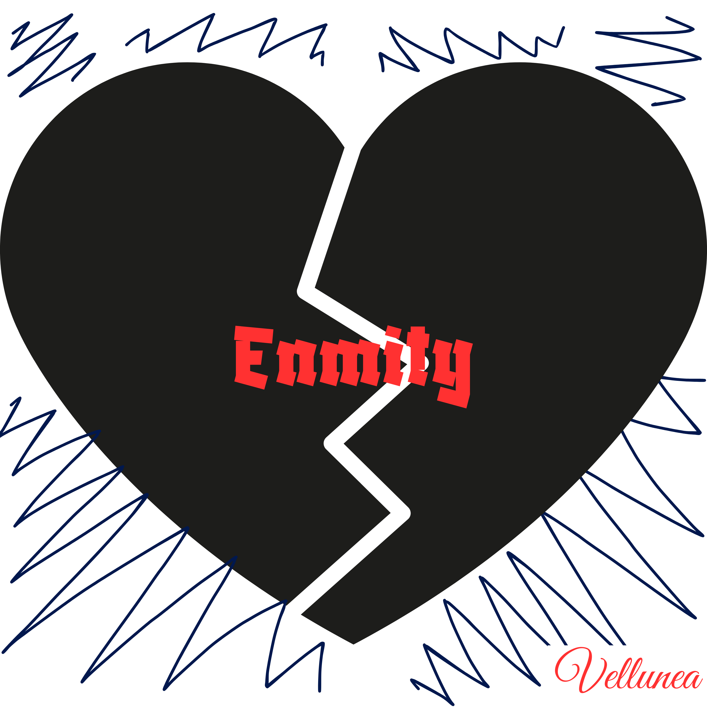

<h1>Music</h1>

alternative/ambient/orchestral pop + electronic + R&B + hip-hop + rap + rock

<!-- Albums section -->
<section class="albums">
  <h2>Albums</h2>

  

    
    

      <h3>idontfeelanything (EP)</h3>
      
<strong>Released:</strong> March 20, 2026

      
<strong>Genres:</strong> alternative orchestral pop electronic

      
A journey through friendship full of trust and betrayal.

      
<a href="https://open.spotify.com/album/0OGWtSn26tF8y2fGPlxc9k?si=kLYK14gyR0q_IFp7vLCrDA" target="_blank" class="pulse-hover">Listen to the full album &rarr;</a>

    

  

  

    <iframe style="border-radius:12px" src="https://open.spotify.com/embed/album/0OGWtSn26tF8y2fGPlxc9k?utm_source=generator" width="100%" height="352" frameborder="0" allowfullscreen allow="autoplay; clipboard-write; encrypted-media; fullscreen; picture-in-picture" loading="lazy"></iframe>
  

</section>

<section class="singles">
  <h2>Singles</h2>

  

    
    

      <h3>idontfeelanything</h3>
      
<strong>Released:</strong> March 20, 2026

      
<strong>Genres:</strong> electronic alternative

      
<a href="https://open.spotify.com/track/32INCvJcNYVGYeISqN15dG?si=895a3b1c3ae044e1" target="_blank" class="pulse-hover">Listen now &rarr;</a>

    

  

  

    
    

      <h3>arewestillfriends?</h3>
      
<strong>Released:</strong> March 13, 2026

      
<strong>Genres:</strong> downtempo alternative

      
<a href="https://open.spotify.com/track/4po4QiURaPwtKB76z0XhXS?si=c8d56c7784ed4966" target="_blank" class="pulse-hover">Listen now &rarr;</a>

    

  

  

    
    

      <h3>alive(lie)</h3>
      
<strong>Released:</strong> January 2, 2026

      
<strong>Genres:</strong> experimental ambient pop

      
<a href="https://open.spotify.com/track/1Is6VmNHjyvol8xSPcL58O?si=84f57d2c0b614fa0" target="_blank" class="pulse-hover">Listen now &rarr;</a>

    

  

  

    
    

      <h3>enmity</h3>
      
<strong>Released:</strong> September 5, 2025

      
<strong>Genres:</strong> rap

      
<a href="https://open.spotify.com/track/0TNH8U7Z0zwex0iMmBtqiS?si=c1484658b646463d" target="_blank" class="pulse-hover">Listen now &rarr;</a>

    

  

  

    
    

      <h3>let go</h3>
      
<strong>Released:</strong> July 18, 2025

      
<strong>Genres:</strong> ambient pop

      
<a href="https://open.spotify.com/track/6DnbfBqt9Tsmf7J8Ad7uiN?si=7ec4bfafdd0a4bd0" target="_blank" class="pulse-hover">Listen now &rarr;</a>

    

  

  

    
    

      <h3>forgotten letters</h3>
      
<strong>Released:</strong> July 18, 2025

      
<strong>Genres:</strong> lofi

      
<a href="https://open.spotify.com/track/2LqwvrAYdjHzf1lg8DbTGP?si=47295668583f4cbf" target="_blank" class="pulse-hover">Listen now &rarr;</a>

    

  

  <!-- Add more singles below by copying the block above -->
</section>

<a href="{{ '/' | relative_url }}" class="back-home pulse-hover">&larr; Back to home</a>

