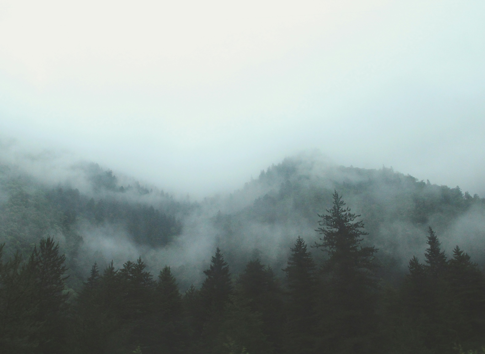
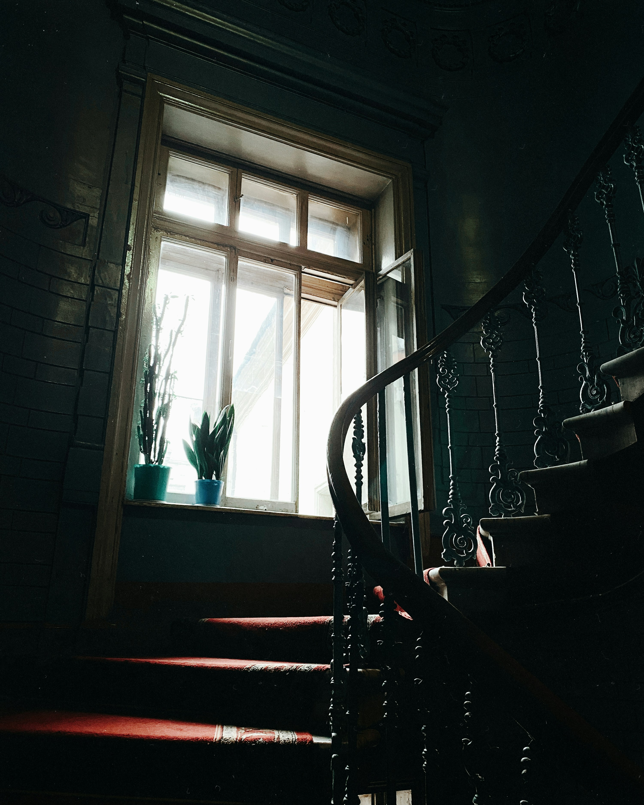
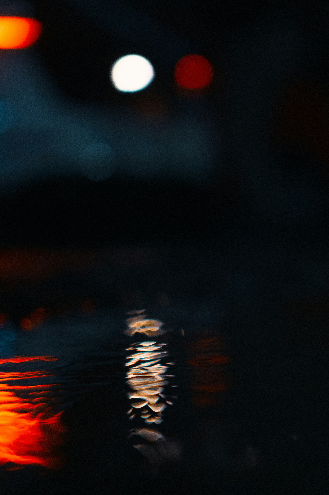
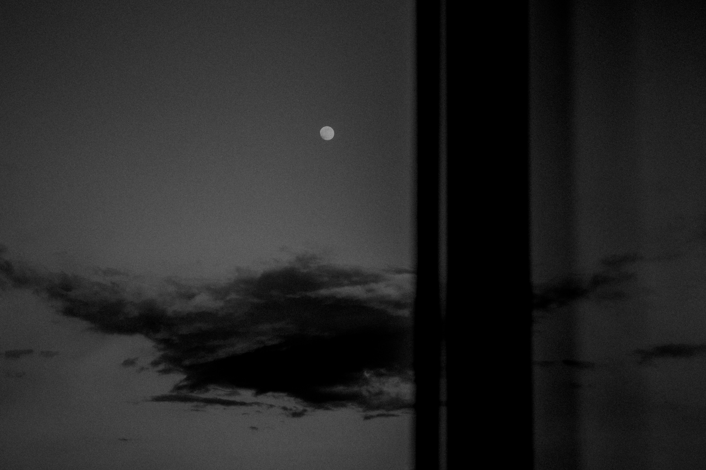

<h1>Visuals</h1>

Dark tones. Moonlight. Fog. Objects with history. Everything has a texture. 
    see more on <a href="https://instagram.com/vellunea.music" target="_blank" style="color:#f4f4f4;">@vellunea.music</a>.

  

    
    
    
    
    
    
  

<a href="{{ '/' | relative_url }}" class="back-home pulse-hover">&larr; Back to home</a>

